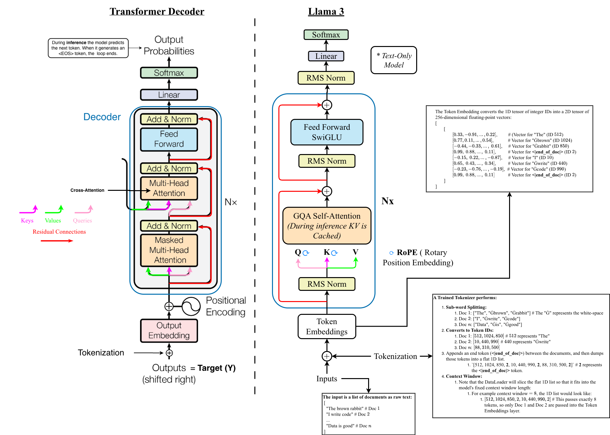

# How To Build An LLM

✨ This project is a guide to building a large language model like ChatGPT, Gemini, or Llama from scratch. I will build and train a scale down version of the Llama 3 architecture (Note: training a full model is very expensive!). Also, I will add options to import pre-trained Llama 3.1 models. I choose Llama over the Gemini and ChatGPT models because it is the most open-sourced and well-documented. Almost all LLMs are built on the Transformer-decoder architecture, with some minor tweaks.

- There are two phases when training an LLM are: # TODO maybe add this info in a train notebook
  - Phase 1: You train a base model on a massive corpus of raw text using self-supervised learning, where its only objective is to predict the next token (e.g., the next word in a sentence). Here the model learns grammar, facts, and reasoning.
  - Phase 2: You take the base model and train it to become a chat/assistant model.This is done by applying fine tuning using structured conversational data (Prompt/Response pairs), which is often followed by Reinforcement Learning form Human Feedback or direct preference optimization to force the model to behave an assistant.

**Useful Links:**

- [Andrej Karpathy's Deep Dive into LLMs video](https://www.youtube.com/watch?v=7xTGNNLPyMI)
- [My Transformer project](https://github.com/t20e/AI_projects_and_res/tree/main/Transformer)

**Goals:**

- [ ] Build out the Llama 3 architecture:
  - [x] Add and pre-process the [FineWeb-edu](https://huggingface.co/datasets/HuggingFaceFW/fineweb-edu) subset of the [FineWeb](https://huggingface.co/datasets/HuggingFaceFW/fineweb) dataset. I will only use a small portion of the FineWeb-edu, which is ~5.84 TB, while the FineWeb is ~54.8 TB.
  - [ ] Implement Llama 3 architecture components.
    - [x] Build the [tokenizer](./model/tokenizer.ipynb).
    - [ ] [RMSNorm](./model/RMSNorm.ipynb)
    - [x] [RoPE](./model/RoPE.ipynb)
    - [ ] [GQA Attention](./model/GQA.ipynb)
    - [ ] The transformer [decoder](./model/decoder.ipynb)
  - [ ] Train a scaled down model, along side its tokenizer.
    - [ ] Make sure that things like special tokens match the larger Llama model! So I dont have two use different special tokens, and other things differently when I use my scaled down or full Llama model. CANDEL

- [ ] Implement Multi-modal so that the model works with:
  - Note: The multi-modal architecture has a Encoder+Decoder architecture.
  - [ ] Chat assistant
  - [ ] Code
  - [ ] Speech
  - [ ] Vision
- [ ] Import a pre-trained Llama model to showcase a SOTA model.
- [ ] Make sure all the math is rendered correctly in the github repo.

## Llama 3 Architecture

- ✨ All the model's layers are implemented in their own notebooks in [./model](./model/).

The fundamental block of an LLM is the **Transformer Decoder**. Most modern frontier LLMs modify the decoder by adding a **RMSNorm**, **RoPE**, and **GQA** sub-layer. There are other variations, for example the Google [Gemma model has **GeGLU**](https://developers.googleblog.com/gemma-explained-new-in-gemma-2/#:~:text=the%20new%20models%3A-,Key%20Differences,-Gemma%202%20shares) non-linearity.

The Llama architecture was first described in [LlaMA: Open and Efficient Foundation Language Models](https://arxiv.org/pdf/2302.13971), which is the Llama 1 and 2 models. The Llama 3 which is described in this paper: [The Llama 3 Herd of Models](https://arxiv.org/pdf/2407.21783), made a few modifications such as:

1. Adding **GQA Attention** with $\mathbf{8}$ key-value heads.
2. Used an attention mask that prevents self-attention between different documents withing the same sequence.
3. Used a vocabulary with $128\text{K}$ total tokens.
   1. Of which $100\text{K}$ is from the **tiktoken** library, and the other $28\text{K}$ is additional tokens to better support non-English languages.
4. Increased the **RoPE** base frequency hyperparameter to $500{,}000$

**#TODOs:**

- [ ] Add info of the Transformers decoder
- [ ] Explain the differences between how chatgpt and gemini are implemented.
- [ ] Add papers from GoodNotes into ./papers
