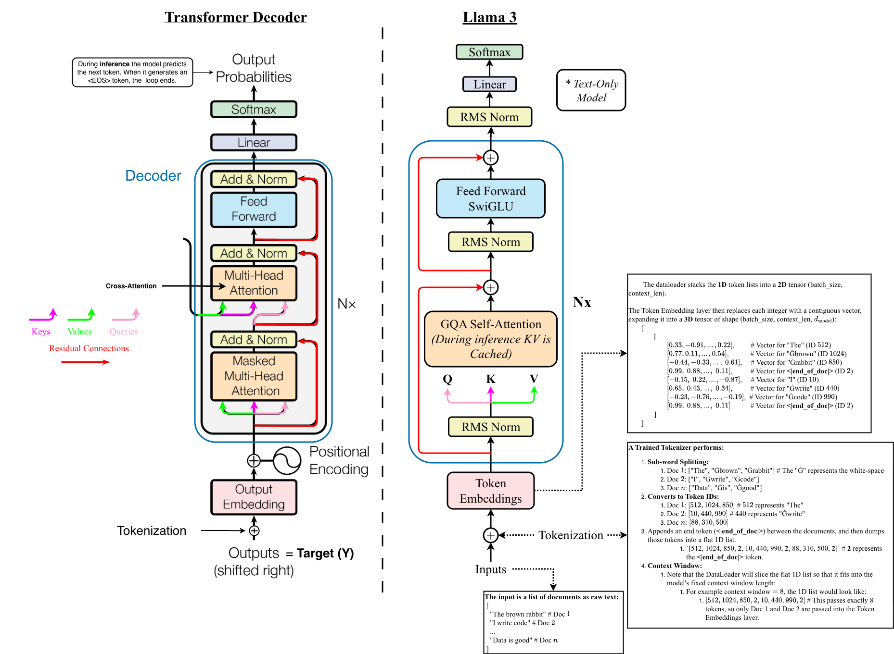

# How To Build An LLM

-#TODO make sure this renders in the github repo

-#TODO: Move training to the cloud.

✨ This project is a guide to building a large language model like ChatGPT, Gemini, or Llama from scratch. I will build and train a scale down version of the Llama 3 architecture. I choose Llama over the Gemini and ChatGPT models because it is the most open-sourced and well-documented. Almost all LLMs are built on the Transformer-decoder architecture, with some minor tweaks.

**What if you want to train a full scale model:**

✨ There are many methods that I did not implement that are worth looking into if you do plan on training on a massive dataset (like the 15.6T tokens) and a large model like th 405B. Here are some:

1. All the datasets for my scaled-down model will be very small compared to the 15.6T dataset, I store each dataset into a large binary file. For a dataset with 15.6T tokens, you will instead want to implement sharding where each dataset is split into binary shards.
2. Use different datasets than I'm using (FineWeb-edu, PG19, FinePdfs, etc...).
   1. The PG19 dataset contains long sequences that the long-context stage of pre-training requires, but its size is only 7.06GB, so for a full scaled model you will need more sequences than the PG19 contains.


**LLM Training Phases:**

- [Phase 1 (Pre-train)](./model/text_only_training/pre_training.ipynb): You train a base model on a massive corpus of raw text using self-supervised learning, where its only objective is to predict the next token (e.g., the next word in a sentence). Here the model learns grammar, facts, and reasoning.
- [Phase 2 (Post-train)](./model/text_only_training/post_training.ipynb): You take the base model and train it to become a chat/assistant model. This is done by applying fine tuning using structured conversational data (Prompt/Response pairs), which is often followed by Reinforcement Learning from Human Feedback or direct preference optimization to force the model to behave an assistant. This model is called the Instruct model.
- Multi-modality (i.e., model can work with text + vision, etc...): Llama 3 multi-modal implementation:
  - Llama 3 adds an encoder for vision.

**Useful Links:**

- [Andrej Karpathy's Deep Dive into LLMs video](https://www.youtube.com/watch?v=7xTGNNLPyMI)
- [Brendan Bycroft LLMs Visualization](https://bbycroft.net/llm)
- [My Transformer Project](https://github.com/t20e/AI_projects_and_res/tree/main/Transformer)
- [Llama 3 Paper](https://arxiv.org/abs/2407.21783) | [Llama 2 Paper](https://arxiv.org/abs/2307.09288) | [Llama 1 Paper](https://arxiv.org/abs/2302.13971)

🥅 **Goals:**

- [x] Add and pre-process datasets:
  - Note: The Llama 3 models were trained on a different datasets than the ones I will be using!
  - [Text-Only model pertaining datasets](./prep/prepare_pretrained.py):
    - [x] [FineWeb-edu](https://huggingface.co/datasets/HuggingFaceFW/fineweb-edu) 10BT subset of the [FineWeb](https://huggingface.co/datasets/HuggingFaceFW/fineweb) dataset. This dataset is used for the initial stage.
    - [x] [PG19](https://huggingface.co/datasets/emozilla/pg19) used for the long-context stage. I needed a dataset that contains long sequences for this stage.
    - [x] [HuggingFaceFW/finepdfs](https://huggingface.co/datasets/HuggingFaceFW/finepdfs) used for the annealing stage.
- [x] Implement Llama 3 architecture components.
  - [x] Build the [tokenizer](./model/tokenizer.ipynb).
  - [x] [RoPE](./model/RoPE.ipynb)
  - [x] [GQA Attention](./model/GQA.ipynb)
  - [x] [SwiGLU Feed Forward](./model/SwiGLU_FFN.ipynb)
  - [x] [RMSNorm](./model/RMSNorm.ipynb)
  - [x] AdamW Optimizer
  - [x] The transformer [decoder](./model/decoder.ipynb)
- [ ] Build the training pipeline.
  - [ ] Pre-training
  - [ ] Post-training:
    - [ ] Supervised Fine-tuning (SFT)
    - [ ] Direct Preference Optimization (DPO)
- [ ] Train a scaled down model.
- [ ] Import a Pre-trained Llama model (e.g., Llama 3.1 8B) from HuggingFace to showcase a SOTA model working with my built-out architecture.
- [ ] Implement Multi-modal so that the model works with Vision.

## Llama 3 Architecture



- ✨ All the model's layers are implemented in their own notebooks in [./model](./model/).
  - ✨ Make sure to check out [configs](./configs.ipynb) to see the configuration details for all models!

The fundamental block of an LLM is the **Transformer Decoder**. Most modern frontier LLMs modify the decoder by adding a **RMSNorm**, **RoPE**, and **GQA** sub-layer. There are other variations, for example the [Google Gemma model](https://developers.googleblog.com/gemma-explained-new-in-gemma-2/#:~:text=the%20new%20models%3A-,Key%20Differences,-Gemma%202%20shares) has **GeGLU** non-linearity.

The Llama 3 architecture made the following modifications to the prior Llama models:

1. Added **GQA Attention** with $\mathbf{8}$ key-value heads.
2. Used an attention mask that prevents self-attention between different documents within the same sequence.
3. Used a vocabulary with $128\text{K}$ total tokens.
   1. Of which $100\text{K}$ is from the **tiktoken** library, and the other $28\text{K}$ is additional tokens to better support non-English languages.
4. Increased the **RoPE** base frequency hyperparameter to $500{,}000$

## Getting Started

**Create the Environment:**

```bash
    #TODO
```

> [!NOTE]
> [Optional] Enable higher download speeds from HuggingFace by logging in to their CLI:
>
> 1. Create an access token at [HuggingFace Tokens](https://huggingface.co/settings/tokens) and set `Token type` to `read` only.
> 1. Login to the HuggingFace CLI:
>
>    ```bash
>    hf auth login
>    # Enter your token and press enter
>    # Enter `n` for git credentials question.
>    ```

### How To Run Inference On My Scaled Down Models

- #TODO

### How To Train

**Build The Pre-Training Dataset:**

```bash
# Optional: 
#    1. use the --tokenizer_only to only train the tokenizer and not build the binary datasets.
#    2. To build small overfit dataset add --overfit
time caffeinate -ism python prepare.py --d pretrain 
```

- #TODO
